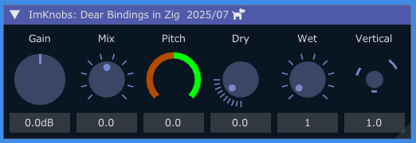
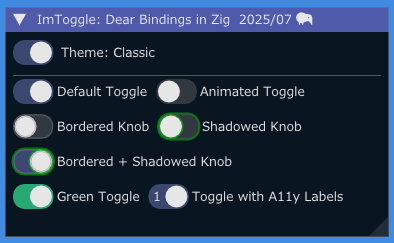
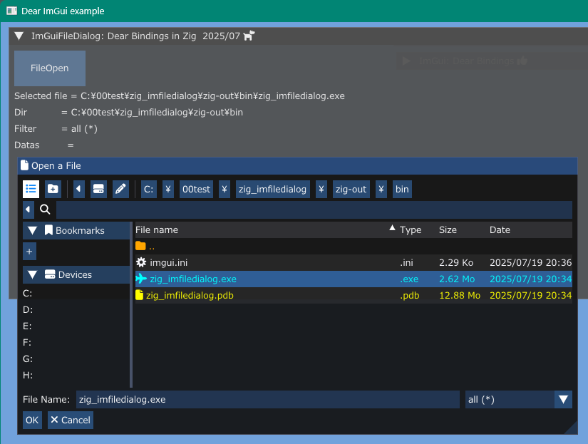
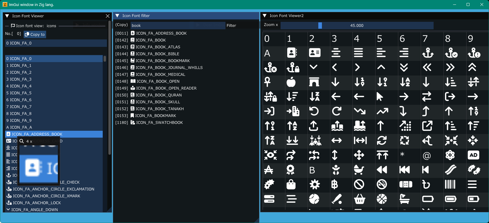

<!-- START doctoc generated TOC please keep comment here to allow auto update -->
<!-- DON'T EDIT THIS SECTION, INSTEAD RE-RUN doctoc TO UPDATE -->

- [Dear_Bindings_Build](#dear_bindings_build)
  - [Features](#features)
  - [Available libraries list at this moment](#available-libraries-list-at-this-moment)
  - [Prerequisites](#prerequisites)
  - [Compiling](#compiling)
  - [Build and run](#build-and-run)
  - [Examples screen shots](#examples-screen-shots)
    - [zig_imknobs](#zig_imknobs)
    - [zig_imtoggle](#zig_imtoggle)
    - [zig_imspinner](#zig_imspinner)
    - [zig_imfiledialog](#zig_imfiledialog)
    - [zig_iconfontviewer](#zig_iconfontviewer)
    - [opengl3](#opengl3)
    - [opengl3_jp](#opengl3_jp)
    - [image_load](#image_load)
  - [Hiding console window](#hiding-console-window)
  - [SDL libraries](#sdl-libraries)
  - [My tools version](#my-tools-version)
  - [Similar project ImGui / CImGui](#similar-project-imgui--cimgui)
  - [SDL game tutorial Platfromer](#sdl-game-tutorial-platfromer)

<!-- END doctoc generated TOC please keep comment here to allow auto update -->

 


### Dear_Bindings_Build

This project aims to simply and easily build ImGui examples with **C language** and **Zig language** using [Dear_Bindings](https://github.com/dearimgui/dear_bindings) as first step.

[Dear ImGui](https://github.com/ocornut/imgui) version **1.92.2b** (2025/08)

#### Features

---

- [x] No dependence on external zig libraries
- [x] No download external libraries
- [x] Included ImGui / GLFW / SDL3 / STB_image libraries in this project
- [x] Using IconFont [FontAwewsome 6](https://fontawesome.com)
- [x] Image load/save

- Frontends and Backends 

   |                    | GLFW   |   SDL3   |
   | ---                | :----: |   :----: |
   | OpenGL3<br>backend | v      |   v      |

#### Available libraries list at this moment

---

Library name / C lang. wrapper

- [x] [ImGui](https://github.com/ocornut/imgui) / [Dear_Bindings](https://github.com/dearimgui/dear_bindings)
- [x] [ImGui-Knobs](https://github.com/altschuler/imgui-knobs) / [CImGui-Knobs](libs/cimgui-knobs) (2025/07)
- [x] [ImGuiFileDialog](https://github.com/aiekick/ImGuiFileDialog) / [CImGuiFileDialog](https://github.com/dinau/CImGuiFileDialog) (2025/07)
- [x] [ImGui_Toggle](https://github.com/cmdwtf/imgui_toggle) / [CimGui_Toggle](https://github.com/dinau/cimgui_toggle) (2025/07)
- [x] [ImSpinner](https://github.com/dalerank/imspinner) / [CImSpinner](https://github.com/dinau/cimspinner) (2025/07)
- [ ] [ImPlot](https://github.com/epezent/implot) / [CImPlot](https://github.com/cimgui/cimplot)
- [ ] [ImPlot3d](https://github.com/brenocq/implot3d) / [CImPlot3d](https://github.com/cimgui/cimplot3d) 
- [ ] [ImNodes](https://github.com/Nelarius/imnodes) / [CImNodes](https://github.com/cimgui/cimnodes) 
- [ ] [ImGuizmo](https://github.com/CedricGuillemet/ImGuizmo) / [CImGuizmo](https://github.com/cimgui/cimguizmo) 
- [ ] [ImGuiColorTextEdit](https://github.com/santaclose/ImGuiColorTextEdit) / [cimCTE](https://github.com/cimgui/cimCTE) 
- [ ] [ImGui_Markdown](https://github.com/enkisoftware/imgui_markdown) 


#### Prerequisites

---

- Windows10 OS or later  
MSys/MinGW basic commands (make, rm, cp ...)
- Linux OS: Debian / Ubunts families
- GCC (or Clang or **'Zig cc'** compiler)
- Zig language Compiler  
Use: [zig-x86_64-windows-0.14.1.zip](https://ziglang.org/download/0.14.1/zig-x86_64-windows-0.14.1.zip) 

#### Compiling 

---

- GCC compiler

   | example                     | Windows | Linux  |
   | ---                         | :----:  | :----: |
   | glfw_opengl3                | v       |        |
   | glfw_opengl3_image_load     | v       |        |
   | glfw_opengl3_image_save     | v       |        |
   | glfw_opengl3_jp             | v       |        |
   | sdl3_opengl3                | v       |        |

- Zig compiler

   | example                     | Windows | Linux  |
   | ---                         | :----:  | :----: |
   | zig_glfw_opengl3            | v       | v      |
   | zig_glfw_opengl3_image_load | v       | v      |
   | zig_iconfontviewer          | v       | v      |
   | zig_imfiledialog            | v       | v      |
   | zig_imkonbs                 | v       | v      |
   | zig_imspinner               | v       | v      |
   | zig_imtoggle                | v       | v      |
   | zig_sdl3_opengl3            | v       |        |


#### Build and run

---

1. Download this project.

   ```sh
   git clone https://github.com/dinau/dear_bindings_build
   ```
1. Go to one of the examples folder,

   ```sh
   cd dear_bindings_build/examples/glfw_opengl3
   ```

1. Build and Run 

   ```sh
   make run                
   ```

#### Examples screen shots 

##### zig_imknobs

---

 [zig_imknobs](examples/zig_imknobs) 



##### zig_imtoggle

---

[zig_imtoggle](examples/zig_imtoggle) 



##### zig_imspinner

---

[zig_imspinner](examples/zig_imspinner) 


##### zig_imfiledialog

---

[zig_imfiledialog](examples/zig_imfiledialog) 



##### zig_iconfontviewer

---

[zig_iconfontviewer](examples/zig_iconfontviewer) 



##### opengl3

---

| Language  |                                          GLFW |                                          SDL3 |
|:---------:|----------------------------------------------:|----------------------------------------------:|
| C lang.   |         [glfw_opengl3](examples/glfw_opengl3) |         [sdl3_opengl3](examples/sdl3_opengl3) |
| Zig lang. | [zig_glfw_opengl3](examples/zig_glfw_opengl3) | [zig_sdl3_opengl3](examples/zig_sdl3_opengl3) |


##### opengl3_jp

---

| Language |                                        GLFW |
|:--------:|--------------------------------------------:|
|  C lang. | [glfw_opengl3_jp](examples/glfw_opengl3_jp) |


##### image_load

---

| Language  |                                                                GLFW |
|:---------:|--------------------------------------------------------------------:|
| C lang.   |         [glfw_opengl3_image_load](examples/glfw_opengl3_image_load) |
| Zig lang. | [zig_glfw_opengl3_image_load](examples/zig_glfw_opengl3_image_load) |


---

|  Language | GLFW                                                                |
|:---------:|--------------------------------------------------------------------:|
|  C lang.  | [glfw_opengl3_image_save](examples/glfw_opengl3_image_save)         |
| Zig lang. | [zig_glfw_opengl3_image_load](examples/zig_glfw_opengl3_image_load) |


  
Image file captured would be saved in current folder.  
Image can be saved as `JPEG / PNG / BMP / TGA` file.

#### Hiding console window

---

- Zig lang. examples  
Open `build.zig` in each example folder and **enable** option line as follows,

  ```zig
  ... snip ...
  exe.subsystem = .Windows;  // Hide console window
  ... snip ...
  ```

  and execute `make`.


- C lang. examples  
Open `Makefile` in each example folder and **change** option as follows,

  ```Makefile
  ... snip ...
  HIDE_CONSOLE_WINDOW = true
  ... snip ...
  ```

  and execute `make`.

#### SDL libraries

---

https://github.com/libsdl-org/SDL  
https://github.com/libsdl-org/SDL/releases

#### My tools version

---

- gcc.exe (Rev2, Built by MSYS2 project) 15.1.0
- make: GNU Make 4.4.1
- Python 3.12.6
- zig: 0.14.1

#### Similar project ImGui / CImGui

---

| Language [^order]    |          | Project                                                                                                                                         |
| -------------------: | :---:    | :----------------------------------------------------------------:                                                                              |
| **Lua**              | Script   | [LuaJITImGui](https://github.com/dinau/luajitImGui)                                                                                             |
| **NeLua**            | Compiler | [NeLuaImGui](https://github.com/dinau/neluaImGui)                                                                                               |
| **Nim**              | Compiler | [ImGuin](https://github.com/dinau/imguin), [Nimgl_test](https://github.com/dinau/nimgl_test), [Nim_implot](https://github.com/dinau/nim_implot) |
| **Python**           | Script   | [DearPyGui for 32bit WindowsOS Binary](https://github.com/dinau/DearPyGui32/tree/win32)                                                         |
| **Ruby**             | Script   | [igRuby_Examples](https://github.com/dinau/igruby_examples)                                                                                     |
| **Zig**, C lang.     | Compiler | [Dear_Bindings_Build](https://github.com/dinau/dear_bindings_build)                                                                             |
| **Zig**              | Compiler | [ImGuinZ](https://github.com/dinau/imguinz)                                                                                                     |


#### SDL game tutorial Platfromer

---


| Language    [^order] |          | SDL         | Project                                                                                                                                               |
| -------------------: | :---:    | :---:       | :----------------------------------------------------------------:                                                                                    |
| **LuaJIT**           | Script   | SDL2        | [LuaJIT-Platformer](https://github.com/dinau/luajit-platformer)
| **Nelua**            | Compiler | SDL2        | [NeLua-Platformer](https://github.com/dinau/nelua-platformer)
| **Nim**              | Compiler | SDL3 / SDL2 | [Nim-Platformer-sdl2](https://github.com/def-/nim-platformer)/ [Nim-Platformer-sdl3](https://github.com/dinau/sdl3_nim/tree/main/examples/platformer) |
| **Ruby**             | Script   | SDL3        | [Ruby-Platformer](https://github.com/dinau/ruby-platformer)                                                                                           |
| **Zig**              | Compiler | SDL3 / SDL2 | [Zig-Platformer](https://github.com/dinau/zig-platformer)                                                                                             |

[^order]: Alphabectial order
