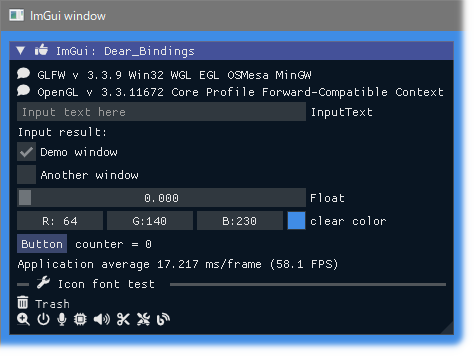
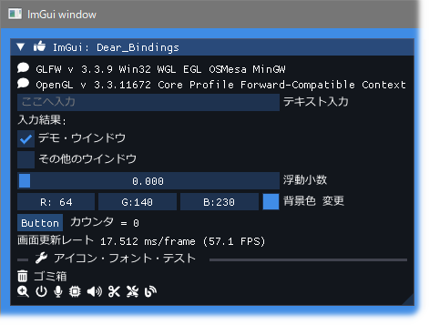
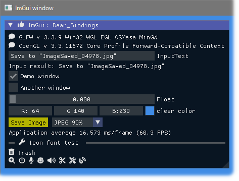

<!-- START doctoc generated TOC please keep comment here to allow auto update -->
<!-- DON'T EDIT THIS SECTION, INSTEAD RE-RUN doctoc TO UPDATE -->

- [Dear_Bindings_Build](#dear_bindings_build)
  - [Prerequisites](#prerequisites)
  - [Build and run](#build-and-run)
  - [Examples screen shots](#examples-screen-shots)
  - [Hiding console window](#hiding-console-window)
  - [SDL](#sdl)
  - [My tools version](#my-tools-version)
- [SDL libraries](#sdl-libraries)
  - [Similar project ImGui / CImGui](#similar-project-imgui--cimgui)
  - [SDL game tutorial Platfromer](#sdl-game-tutorial-platfromer)

<!-- END doctoc generated TOC please keep comment here to allow auto update -->


  

  

### Dear_Bindings_Build

This project aims to simply and easily build ImGui examples with **C language** and **Zig language** using [Dear_Bindings](https://github.com/dearimgui/dear_bindings) as first step.

ImGui version **1.92.0** (2025/06)

#### Prerequisites

---

- Windows10 OS or later
- GCC (or Clang or **'Zig cc'** compiler)
- Use **Zig: 0.14.1** 
- MSys/MinGW basic commands (make, rm, cp ...)

#### Build and run

---

|    OS   |        State       |
|:-------:|:------------------:|
| Windows |         OK         |
|  Linux  | Work in progress ? |

1. Download this project.

   ```sh
   git clone --recurse-submodules https://github.com/dinau/dear_bindings_build
   ```
1. Go to one of the examples folder,

   ```sh
   cd dear_bindings_build/examples/glfw_opengl3
   ```

1. Build and Run 

   ```sh
   make run                
   ```

#### Examples screen shots 

---

| Language  |                                          GLFW |                                          SDL2 |                                          SDL3 |
|:---------:|----------------------------------------------:|----------------------------------------------:|----------------------------------------------:|
| C lang.   |         [glfw_opengl3](examples/glfw_opengl3) |         [sdl2_opengl3](examples/sdl2_opengl3) |         [sdl3_opengl3](examples/sdl3_opengl3) |
| Zig lang. | [zig_glfw_opengl3](examples/zig_glfw_opengl3) | [zig_sdl2_opengl3](examples/zig_sdl2_opengl3) | [zig_sdl3_opengl3](examples/zig_sdl3_opengl3) |





---

| Language |                                        GLFW |
|:--------:|--------------------------------------------:|
|  C lang. | [glfw_opengl3_jp](examples/glfw_opengl3_jp) |




---

| Language  |                                                                GLFW |
|:---------:|--------------------------------------------------------------------:|
| C lang.   |         [glfw_opengl3_image_load](examples/glfw_opengl3_image_load) |
| Zig lang. | [zig_glfw_opengl3_image_load](examples/zig_glfw_opengl3_image_load) |


---

|  Language | GLFW                                                                |
|:---------:|--------------------------------------------------------------------:|
|  C lang.  | [glfw_opengl3_image_save](examples/glfw_opengl3_image_save)         |
| Zig lang. | [zig_glfw_opengl3_image_load](examples/zig_glfw_opengl3_image_load) |


  
Image file captured would be saved in current folder.  
Image can be saved as `JPEG / PNG / BMP / TGA` file.

#### Hiding console window

---

- Zig lang. examples  
Open `build.zig` in each example folder and **enable** option line as follows,

  ```zig
  ... snip ...
  exe.subsystem = .Windows;  // Hide console window
  ... snip ...
  ```

  and execute `make`.


- C lang. examples  
Open `Makefile` in each example folder and **change** option as follows,

  ```Makefile
  ... snip ...
  HIDE_CONSOLE_WINDOW = true
  ... snip ...
  ```

  and execute `make`.

#### SDL

---

https://github.com/libsdl-org/SDL

#### My tools version

---

- gcc.exe (Rev2, Built by MSYS2 project) 15.1.0
- make: GNU Make 4.4.1
- Python 3.12.6
- zig: 0.14.1

### SDL libraries

---

https://github.com/libsdl-org/SDL/releases

#### Similar project ImGui / CImGui

---

| Language [^order]    |          | Project                                                                                                                                         |
| -------------------: | :---:    | :----------------------------------------------------------------:                                                                              |
| **Lua**              | Script   | [LuaJITImGui](https://github.com/dinau/luajitImGui)                                                                                             |
| **NeLua**            | Compiler | [NeLuaImGui](https://github.com/dinau/neluaImGui)                                                                                               |
| **Nim**              | Compiler | [ImGuin](https://github.com/dinau/imguin), [Nimgl_test](https://github.com/dinau/nimgl_test), [Nim_implot](https://github.com/dinau/nim_implot) |
| **Python**           | Script   | [DearPyGui for 32bit WindowsOS Binary](https://github.com/dinau/DearPyGui32/tree/win32)                                                         |
| **Ruby**             | Script   | [igRuby_Examples](https://github.com/dinau/igruby_examples)                                                                                     |
| **Zig**, C lang.     | Compiler | [Dear_Bindings_Build](https://github.com/dinau/dear_bindings_build)                                                                             |
| **Zig**              | Compiler | [ImGuinZ](https://github.com/dinau/imguinz)                                                                                                     |


#### SDL game tutorial Platfromer

---


| Language    [^order] |          | SDL         | Project                                                                                                                                               |
| -------------------: | :---:    | :---:       | :----------------------------------------------------------------:                                                                                    |
| **LuaJIT**           | Script   | SDL2        | [LuaJIT-Platformer](https://github.com/dinau/luajit-platformer)
| **Nelua**            | Compiler | SDL2        | [NeLua-Platformer](https://github.com/dinau/nelua-platformer)
| **Nim**              | Compiler | SDL3 / SDL2 | [Nim-Platformer-sdl2](https://github.com/def-/nim-platformer)/ [Nim-Platformer-sdl3](https://github.com/dinau/sdl3_nim/tree/main/examples/platformer) |
| **Ruby**             | Script   | SDL3        | [Ruby-Platformer](https://github.com/dinau/ruby-platformer)                                                                                           |
| **Zig**              | Compiler | SDL2        | [Zig-Platformer](https://github.com/dinau/zig-platformer)                                                                                             |

[^order]: Alphabectial order
