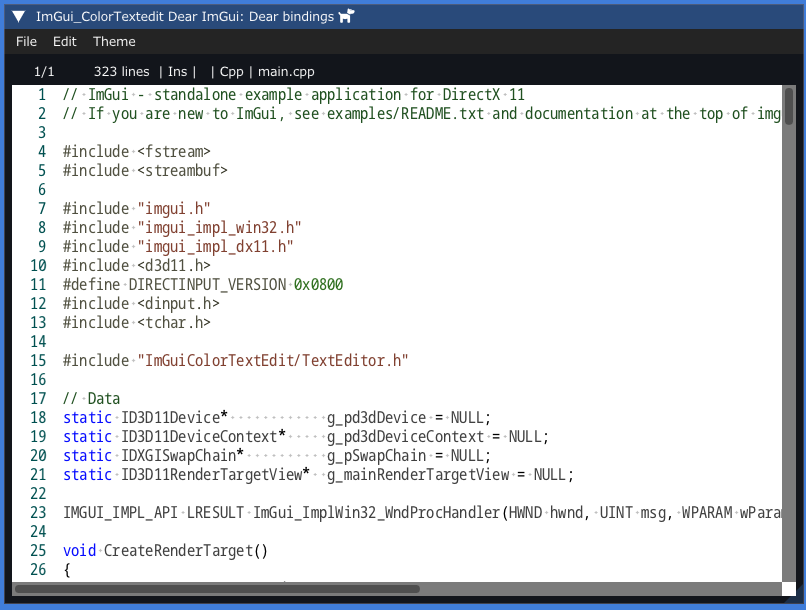
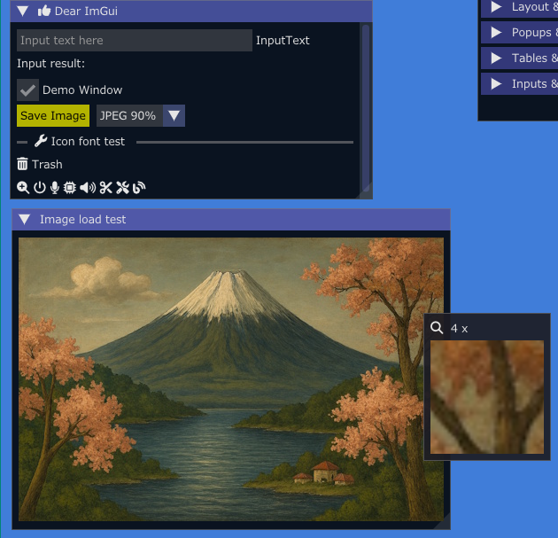

<!-- START doctoc generated TOC please keep comment here to allow auto update -->
<!-- DON'T EDIT THIS SECTION, INSTEAD RE-RUN doctoc TO UPDATE -->

- [Dear_Bindings_Build](#dear_bindings_build)
  - [Features](#features)
  - [Available libraries list at this moment](#available-libraries-list-at-this-moment)
  - [Prerequisites](#prerequisites)
  - [Compiling](#compiling)
  - [Build and run](#build-and-run)
  - [Examples screen shots](#examples-screen-shots)
    - [zig_imknobs](#zig_imknobs)
    - [zig_imtoggle](#zig_imtoggle)
    - [zig_imspinner](#zig_imspinner)
    - [zig_imfiledialog](#zig_imfiledialog)
    - [zig_imgui_markdown](#zig_imgui_markdown)
    - [zig_iconfontviewer](#zig_iconfontviewer)
    - [zig_imcolortextedit](#zig_imcolortextedit)
    - [zig_imguizmo](#zig_imguizmo)
    - [zig_imnodes](#zig_imnodes)
    - [zig_implot / zig_implot3d](#zig_implot--zig_implot3d)
    - [Image load / save (OpenGL, SDL3, SDL3GPU)](#image-load--save-opengl-sdl3-sdl3gpu)
    - [zig_glfw_opengl3](#zig_glfw_opengl3)
  - [Hiding console window](#hiding-console-window)
  - [SDL libraries](#sdl-libraries)
  - [My tools version](#my-tools-version)
  - [Similar project ImGui / CImGui](#similar-project-imgui--cimgui)
  - [SDL game tutorial Platfromer](#sdl-game-tutorial-platfromer)

<!-- END doctoc generated TOC please keep comment here to allow auto update -->

### Dear_Bindings_Build

This project aims to simply and easily build [Dear ImGui](https://github.com/ocornut/imgui) examples with **C language** and **Zig language** using [Dear_Bindings](https://github.com/dearimgui/dear_bindings) as first step.

[DearBindings](https://github.com/dearimgui/dear_bindings): dear_bindings_v0.17_ImGui_v1.92.4-docking  
[Dear ImGui](https://github.com/ocornut/imgui)

#### Features

---

- [x] No download external libraries  
Included Dear_Bindings / Dear ImGui / GLFW / SDL3 / STB_image libraries in this project
- [x] Included IconFont [FontAwewsome 6](https://fontawesome.com)
- [x] Image load/save example

- Frontends and Backends  
   - GLFW3  - OpenGL3, SDL3
   - SDL3   - OpenGL3, SDL3GPU, Vulkan (WIP)
  

#### Available libraries list at this moment

---

Library name / C lang. wrapper

- [x] [ImGui](https://github.com/ocornut/imgui) / [Dear_Bindings](https://github.com/dearimgui/dear_bindings)
- [x] [ImGui-Knobs](https://github.com/altschuler/imgui-knobs) / [CImGui-Knobs](libs/cimgui-knobs) (2025/07)
- [x] [ImGuiFileDialog](https://github.com/aiekick/ImGuiFileDialog) / [CImGuiFileDialog](https://github.com/dinau/CImGuiFileDialog) (2025/07)
- [x] [ImGui_Toggle](https://github.com/cmdwtf/imgui_toggle) / [CimGui_Toggle](https://github.com/dinau/cimgui_toggle) (2025/07)
- [x] [ImSpinner](https://github.com/dalerank/imspinner) / [CImSpinner](https://github.com/dinau/cimspinner) (2025/07)
- [x] [ImGuiColorTextEdit](https://github.com/santaclose/ImGuiColorTextEdit) / [cimCTE](https://github.com/cimgui/cimCTE) (2025/08)
- [x] [ImGuizmo](https://github.com/CedricGuillemet/ImGuizmo) / [CImGuizmo](https://github.com/cimgui/cimguizmo) (2025/08)
- [x] [ImNodes](https://github.com/Nelarius/imnodes) / [CImNodes](https://github.com/cimgui/cimnodes) (2025/08)
- [x] [ImPlot](https://github.com/epezent/implot) / [CImPlot](https://github.com/cimgui/cimplot) (2025/08)
- [x] [ImPlot3d](https://github.com/brenocq/implot3d) / [CImPlot3d](https://github.com/cimgui/cimplot3d)  (2025/08)
- [ ] [ImGui_Markdown](https://github.com/enkisoftware/imgui_markdown) (2025/09 WIP) 

#### Prerequisites

---

- Windows11  
MSys2/MinGW basic commands (make, rm, cp ...)

   ```sh
   pacman -S make mingw-w64-x86_64-{gcc,vulkan-headers,vulkan-loader}
   ```

   Vulkan version: 1.4.xxx
- Linux OS: Debian13 Trixie / Ubuntu families

   ```sh
   sudo apt install make gcc lib{opengl-dev,gl1-mesa-dev,glfw3,glfw3-dev}
   sudo apt install libvulkan1 mesa-vulkan-drivers vulkan-utils
   ```
   
   - SDL3  
   If you are using Debian13 Trixie, add

      ```sh
      sudo apt install libsdl3-dev
      ```

      otherwise [install SDL3 manually](https://github.com/dinau/sdl3_nim#for-linux-os)


- GCC (or Clang or **'zig cc'** compiler)
- Install Zig Compiler  
   Windows: [zig-x86_64-windows-0.15.2.zip](https://ziglang.org/download/0.15.2/zig-x86_64-windows-0.15.2.zip)  
   Linux:   [zig-x86_64-linux-0.15.2.tar.xz](https://ziglang.org/download/0.15.2/zig-x86_64-linux-0.15.2.tar.xz)

#### Compiling 

---

- Zig compiler

   | Example name    | Windows | Linux  | Mac OS [^macpr] |
   | ---             | :----:  | :----: | :---:           |
   | zig_*           | Y       | Y      | -               |
   | zig_sdl3_vulkan | WIP     | WIP    | -               |

- GCC compiler

   | example | Windows | Linux  | Mac OS |
   | ---     | :----:  | :----: | :---:  |
   | glfw_*  | Y       | Y      | -      |
   | sdl3_*  | Y       | WIP    | -      |


[^macpr]:PR welcome 

#### Build and run

---

```sh
git clone https://github.com/dinau/dear_bindings_build
cd dear_bindings_build/examples/glfw_opengl3           # for example
make run                
```

#### Examples screen shots 

##### zig_imknobs

---

 [zig_imknobs](examples/zig_imknobs/src/main.zig) 


##### zig_imtoggle

---

[zig_imtoggle](examples/zig_imtoggle/src/main.zig) 


##### zig_imspinner

---

[zig_imspinner](examples/zig_imspinner/src/main.zig) 


##### zig_imfiledialog

---

[zig_imfiledialog](examples/zig_imfiledialog/src/main.zig) 


##### zig_imgui_markdown

---

- [x] Work in progress

[zig_imgui_markdown](examples/zig_imgui_markdown/src/main.zig) 


##### zig_iconfontviewer

---

[zig_iconfontviewer](examples/zig_iconfontviewer/src/main.zig) 

- [x] Incremantal search 
- [x] Magnifing glass


##### zig_imcolortextedit

---

[zig_imcolortextedit](examples/zig_imcolortextedit/src/main.zig) 



##### zig_imguizmo

---

[zig_imguizmo](examples/zig_imguizmo/src/main.zig) 


##### zig_imnodes

---

[zig_imnodes](examples/zig_imnodes/src/main.zig) 


##### zig_implot / zig_implot3d

---

[zig_implot](examples/zig_implot/src/main.zig) /  [zig_implot3d](examples/zig_implot3d/src/main.zig) 

[zig_imPlotDemo](examples/zig_imPlotDemo/src/demoAll.zig) written in Zig.

  


##### Image load / save (OpenGL, SDL3, SDL3GPU)

---

|  Language |                                                                             GLFW | Magnifing glass | Image load /save |
|:---------:|---------------------------------------------------------------------------------:|:---------------:|:----------------:|
|  C lang.  |                      [glfw_opengl3_image_load](examples/glfw_opengl3_image_load) |        -        |         Y        |
|  C lang.  |                      [glfw_opengl3_image_save](examples/glfw_opengl3_image_save) |        -        |         Y        |
| Zig lang. | [zig_glfw_opengl3_image_load](examples/zig_glfw_opengl3_image_load/src/main.zig) |        Y        |         Y        |
| Zig lang. |                       [zig_sdl3_sdlgup3](examples/zig_sdl3_sdlgpu3/src/main.zig) |        -        |       load       |

- [x] Image file captured will be saved in current folder.  
- [x] Image format can be selected from `JPEG / PNG / BMP / TGA`.



##### zig_glfw_opengl3

---

- [x] Basic example

|  Language |                                                                               GLFW |                                                       SDL3 |
|:---------:|-----------------------------------------------------------------------------------:|-----------------------------------------------------------:|
|  C lang.  | [glfw_opengl3](examples/glfw_opengl3), [glfw_opengl3_jp](examples/glfw_opengl3_jp) |                      [sdl3_opengl3](examples/sdl3_opengl3) |
| Zig lang. |                         [zig_glfw_opengl3](examples/zig_glfw_opengl3/src/main.zig) | [zig_sdl3_opengl3](examples/zig_sdl3_opengl3/src/main.zig) |


 

#### Hiding console window

---

- Zig lang. examples  
Open `build.zig` in each example folder and **enable** option line as follows,

  ```zig
  ... snip ...
  exe.subsystem = .Windows;  // Hide console window
  ... snip ...
  ```

  and execute `make`.


- C lang. examples  
Open `Makefile` in each example folder and **change** option as follows,

  ```Makefile
  ... snip ...
  HIDE_CONSOLE_WINDOW = true
  ... snip ...
  ```

  and execute `make`.

#### SDL libraries

---

https://github.com/libsdl-org/SDL  
https://github.com/libsdl-org/SDL/releases

#### My tools version

---

- gcc.exe (Rev2, Built by MSYS2 project) 15.2.0
- make: GNU Make 4.4.1
- Python 3.12.10

#### Similar project ImGui / CImGui

---

| Language             |          | Project                                                                                                                                         |
| -------------------: | :---:    | :----------------------------------------------------------------:                                                                              |
| **Lua**              | Script   | [LuaJITImGui](https://github.com/dinau/luajitImGui)                                                                                             |
| **NeLua**            | Compiler | [NeLuaImGui](https://github.com/dinau/neluaImGui)                                                                                               |
| **Nim**              | Compiler | [ImGuin](https://github.com/dinau/imguin), [Nimgl_test](https://github.com/dinau/nimgl_test), [Nim_implot](https://github.com/dinau/nim_implot) |
| **Python**           | Script   | [DearPyGui for 32bit WindowsOS Binary](https://github.com/dinau/DearPyGui32/tree/win32)                                                         |
| **Ruby**             | Script   | [igRuby_Examples](https://github.com/dinau/igruby_examples)                                                                                     |
| **Zig**, C lang.     | Compiler | [Dear_Bindings_Build](https://github.com/dinau/dear_bindings_build)                                                                             |
| **Zig**              | Compiler | [ImGuinZ](https://github.com/dinau/imguinz)                                                                                                     |


#### SDL game tutorial Platfromer

---


| Language    |          | SDL         | Project                                                                                                                                               |
| -------------------: | :---:    | :---:       | :----------------------------------------------------------------:                                                                                    |
| **LuaJIT**           | Script   | SDL2        | [LuaJIT-Platformer](https://github.com/dinau/luajit-platformer)
| **Nelua**            | Compiler | SDL2        | [NeLua-Platformer](https://github.com/dinau/nelua-platformer)
| **Nim**              | Compiler | SDL3 / SDL2 | [Nim-Platformer-sdl2](https://github.com/def-/nim-platformer)/ [Nim-Platformer-sdl3](https://github.com/dinau/sdl3_nim/tree/main/examples/platformer) |
| **Ruby**             | Script   | SDL3        | [Ruby-Platformer](https://github.com/dinau/ruby-platformer)                                                                                           |
| **Zig**              | Compiler | SDL3 / SDL2 | [Zig-Platformer](https://github.com/dinau/zig-platformer)                                                                                             |
